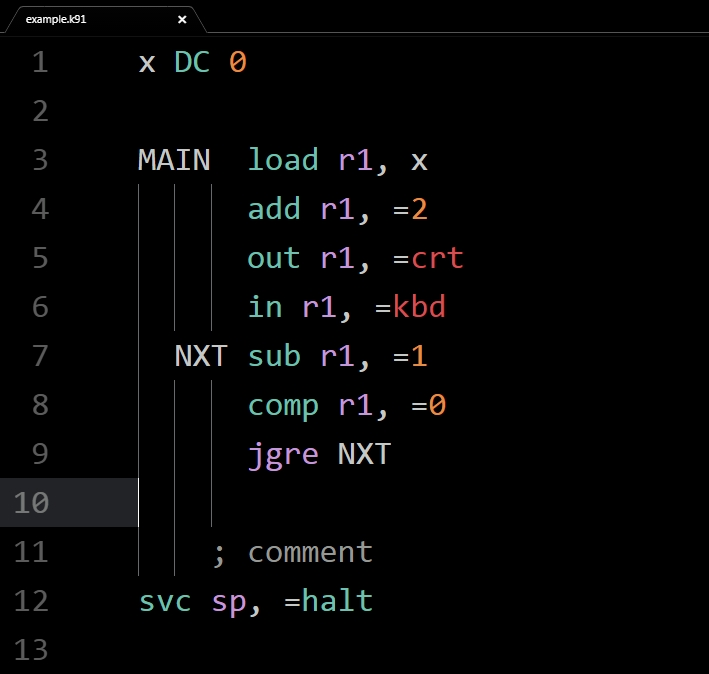

****language-ttk91****

This is a grammar specification for the symbolic machine, or assembly language *ttk91* used by the virtual computer environment [**titokone** ](https://github.com/titokone/titokone). It enables the text editor [**Atom**](https://atom.io/)'s syntax highlighting to pick up the various keywords, operators etc used in TTK91.

****Installation:****

Close Atom if you have it running. Then type in a terminal of your choice:

`apm install jiikai/language-ttk91`

Atom should automatically detect files with *.k91* file extension as being written in ttk91, set the grammar manually via `CTRL+SHIFT+L` if it does not.

****Caveats:****

- This package does ****not**** provide error-checking for invalid syntax or debugging/linter functionality. It serves only to facilitate syntax highlighting of inbuilt operations, register IDs etc.
- Note that this is a work in progress. You are free to contribute to or modify the grammar specification as you see fit.
- The main motivation for writing this was to advance my own understanding of the language and facilitate faster learning. Thus it also reflects an incomplete understanding of the syntax and workings of titokone's architecture.

****Bugs:****

Post any issues in:

 https://github.com/jiikai/language-ttk91/issues
